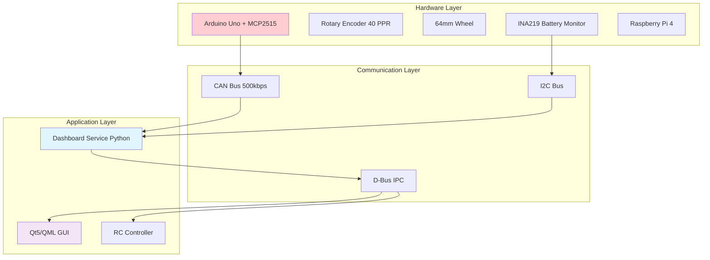
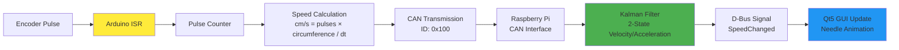
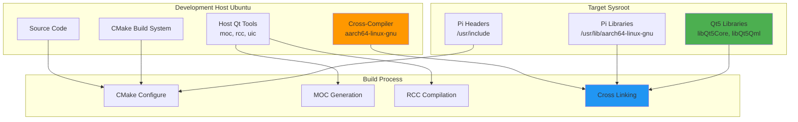
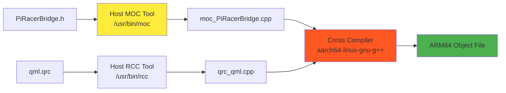
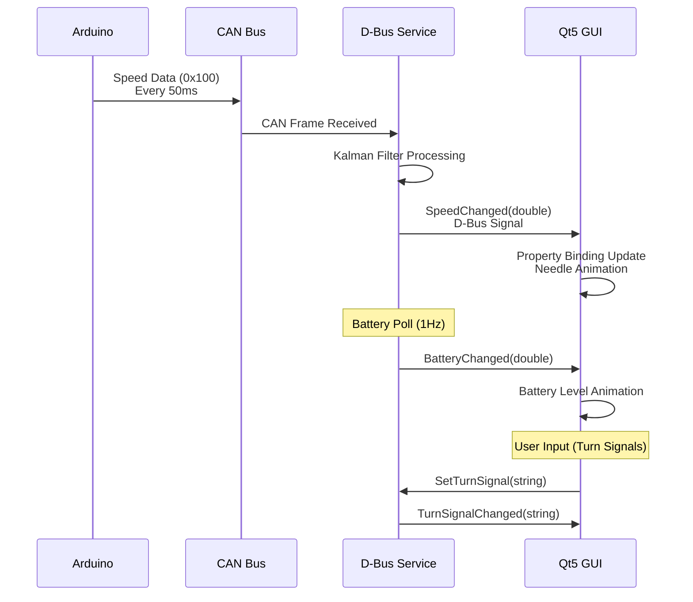
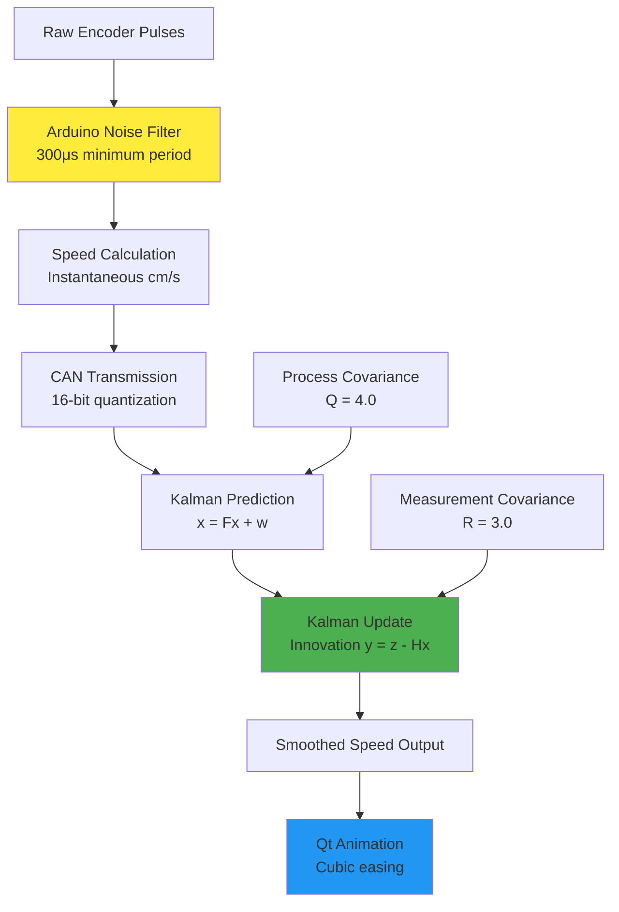

# PiRacer Instrument Cluster
## Real-Time Embedded System Architecture

---

## Project Overview

**Objective**: Real-time instrument cluster for autonomous PiRacer vehicle

**Key Components**:
- Arduino-based speed sensor with CAN communication
- Raspberry Pi 4 with D-Bus service architecture
- Qt5/QML cross-compiled GUI with live telemetry
- Kalman filtering for signal processing
- Automotive-grade CAN bus communication

**Performance**: 20Hz speed updates, 60 FPS GUI rendering, sub-100ms latency

---

## System Architecture



---

## Data Acquisition Pipeline



**Update Rate**: 50ms (20Hz) Arduino → 250ms Qt Animation

---

## CAN Bus Protocol

### Message Structure
```
CAN ID 0x100 (Speed Data):
┌─────────┬─────────┐
│ Byte 0  │ Byte 1  │ Speed (cm/s)
│  MSB    │  LSB    │ Big-endian 16-bit
└─────────┴─────────┘

CAN ID 0x102 (Gear Data):
┌─────────┐
│ Byte 0  │ ASCII Character
│ P/R/N/D │ Current Gear
└─────────┘
```

### Speed Encoding
- **Range**: 0-655.35 m/s (16-bit resolution)
- **Precision**: 1 cm/s
- **Transmission**: Big-endian format
- **Frequency**: 20Hz continuous

---

## Kalman Filter Implementation

### State Vector
```
x = [v, a]ᵀ  (velocity, acceleration)
```

### State Transition
```
F = [1  Δt]    (kinematic model)
    [0   1]

Q = [Δt⁴/4  Δt³/2] × σ²process
    [Δt³/2   Δt²]

R = [σ²measurement]
```

### Tuning Parameters
- **Process Variance**: 4.0 (vehicle dynamics uncertainty)
- **Measurement Variance**: 3.0 (encoder noise)
- **Update Rate**: Variable (20-50Hz adaptive)

---

## Cross-Compilation Architecture



---

## Cross-Compilation Toolchain

### CMake Toolchain Configuration
```cmake
set(CMAKE_SYSTEM_NAME Linux)
set(CMAKE_SYSTEM_PROCESSOR aarch64)
set(CMAKE_C_COMPILER aarch64-linux-gnu-gcc)
set(CMAKE_CXX_COMPILER aarch64-linux-gnu-g++)
set(CMAKE_SYSROOT $ENV{RPI_SYSROOT})

# Cortex-A72 optimizations
set(CMAKE_CXX_FLAGS "-mcpu=cortex-a72 -O3")
```

### Qt5 Cross-Compilation Challenges
- **MOC/RCC**: Must use host tools, not target tools
- **pkg-config**: Requires sysroot-aware configuration
- **Library Paths**: Manual resolution for aarch64 libraries

---

## Qt Meta Object Compilation

### MOC Process


**Critical**: Host tools generate C++ code, cross-compiler creates ARM64 binaries

---

## D-Bus Communication Flow



---

## D-Bus Interface Specification

### Service Definition
```
Service: com.piracer.dashboard
Object: /com/piracer/dashboard
Interface: com.piracer.dashboard
```

### Methods & Signals
```cpp
// Synchronous Getters
double GetSpeed()           // Returns cm/s
double GetBatteryLevel()    // Returns 0-100%
string GetGear()           // Returns P/R/N/D

// Asynchronous Setters
void SetTurnSignal(string mode)  // off/left/right/hazard

// Real-time Signals
signal SpeedChanged(double speed)
signal BatteryChanged(double percent)
signal TurnSignalChanged(string mode)
```

---

## Qt5 Property System Integration

### QML Property Bindings
```qml
// PiRacerBridge C++ Object
PiRacerBridge {
    Q_PROPERTY(double speed NOTIFY speedChanged)
    Q_PROPERTY(bool leftTurn NOTIFY leftTurnChanged)
}

// QML Animation Binding
Rotation {
    angle: mapRangeClamped(bridge.speed, 0, 300, -130, 130)
    Behavior on angle {
        NumberAnimation { duration: 180; easing.type: Easing.InOutCubic }
    }
}
```

### Signal-Slot Connection
```cpp
// D-Bus to Qt Bridge
connect(&dbus_service, SIGNAL(SpeedChanged(double)),
        this, SLOT(onSpeedChanged(double)));
```

---

## Real-Time Performance Characteristics

### Latency Analysis
```
Encoder Edge → Arduino ISR:           ~10μs
Pulse Count → CAN TX:                 ~50ms (buffered)
CAN RX → Kalman Filter:               ~1ms
Kalman Filter → D-Bus Signal:         ~2ms
D-Bus → Qt Property Update:           ~5ms
Qt Animation Frame:                   ~16ms (60 FPS)
```

**Total System Latency**: ~74ms (well under 100ms target)

### Update Frequencies
- **Speed Measurement**: 20Hz (50ms period)
- **Battery Monitor**: 1Hz (1s period)
- **GUI Rendering**: 60Hz (16.7ms period)
- **CAN Bus Utilization**: <1% (low traffic)

---

## Signal Processing Pipeline



---

## Key Technical Achievements

### Embedded Systems Integration
- **Multi-protocol Communication**: CAN Bus + I2C + D-Bus
- **Real-time Constraints**: Sub-100ms end-to-end latency
- **Cross-platform Development**: x86_64 → aarch64 compilation

### Signal Processing
- **Kalman Filtering**: 2-state velocity/acceleration model
- **Noise Rejection**: Hardware and software filtering layers
- **Adaptive Update Rates**: Variable dt compensation

### Software Architecture
- **Modular Design**: Arduino firmware, Python service, Qt GUI
- **Automotive Standards**: CAN bus protocol compliance
- **Professional Toolchain**: CMake, cross-compilation, pkg-config

---

## Performance Validation

### Speed Accuracy
- **Encoder Resolution**: 40 PPR × 64mm wheel = 5.03mm per pulse
- **Measurement Range**: 0-300 cm/s (0-10.8 km/h)
- **Filter Stability**: <2% overshoot, 200ms settling time

### System Resources (Raspberry Pi 4)
- **CPU Usage**: 15-20% (Qt5 + D-Bus service)
- **Memory**: 45MB RAM (Qt5 GUI), 12MB (Python service)
- **CAN Bus Load**: <1% utilization at 20Hz updates

### Cross-Compilation Metrics
- **Build Time**: 45 seconds (clean build with -j4)
- **Binary Size**: 2.1MB (statically linked Qt resources)
- **Dependency Verification**: Zero dynamic linking failures
